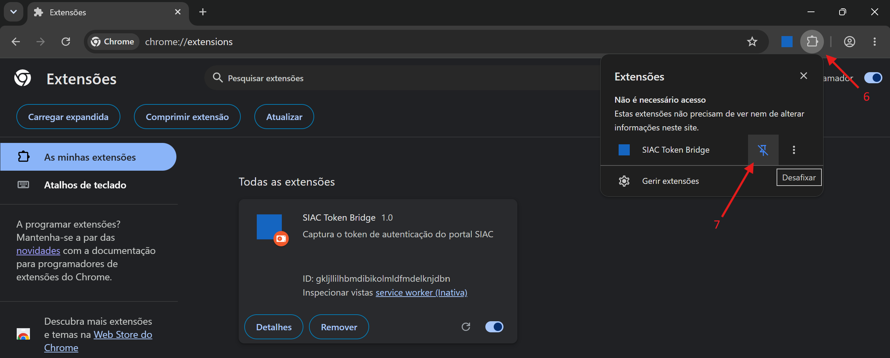

# SIAC Token Bridge

Browser extension that captures the authentication token from [portal.siac.pt](https://portal.siac.pt) (Portuguese national animal identification and registration system) and exposes it to authorized veterinary clinic applications via a secure messaging bridge.

This enables automatic animal data lookup by microchip number without requiring a separate login flow in the clinic application.

## How It Works

1. The user logs in to portal.siac.pt as usual
2. The extension automatically captures and stores the Bearer token
3. When the clinic app needs to look up an animal, it requests the token from the extension
4. The token is used for a single API call and is never stored by the clinic app

## Available Versions

| Browser | Manifest | Folder |
|---------|----------|--------|
| Google Chrome / Edge | Manifest V3 | `siac-extension-chrome/` |
| Mozilla Firefox | Manifest V2 | `siac-extension-firefox/` |

---

## Installation Guide

### Google Chrome / Microsoft Edge

1. Download or clone this repository

2. Open Chrome and navigate to `chrome://extensions/`

3. Enable **Developer mode** (toggle in the top-right corner)

[Chrome Developer Mode](docs/images/chrome-developer-mode.png)

4. Click **"Load unpacked"**

<!--  -->

5. Select the `siac-extension-chrome/` folder

6. The extension should now appear in your extensions list with the SIAC Token Bridge icon

<!--  -->

7. Pin the extension to the toolbar for easy access (click the puzzle icon, then the pin)

<!--  -->

---

### Mozilla Firefox

1. Download or clone this repository

2. Open Firefox and navigate to `about:debugging#/runtime/this-firefox`

3. Click **"Load Temporary Add-on..."**

<!--  -->

4. Navigate to the `siac-extension-firefox/` folder and select the `manifest.json` file

5. The extension should now appear in the list of temporary extensions

<!--  -->

> **Note:** Temporary add-ons in Firefox are removed when the browser is closed. For permanent installation, the extension must be signed through [addons.mozilla.org](https://addons.mozilla.org) or installed in Firefox Developer/Nightly with `xpinstall.signatures.required` set to `false`.

---

## Usage

### 1. Log in to Portal SIAC

Open [portal.siac.pt](https://portal.siac.pt) and log in with your credentials. The extension will automatically capture the token.

<!--  -->

### 2. Verify Token Status

Click the extension icon in the toolbar to check the token status. You should see a confirmation that the token has been captured and its expiry time.

<!--  -->

### 3. Use in the Clinic Application

In the clinic application, when creating or editing a patient, enter the microchip number (15 digits) and click the search button. The app will automatically request the token from the extension and look up the animal data.

<!--  -->

<!--  -->

### Token Expired / Not Available

If the token has expired or you haven't logged in, the extension popup will indicate the issue. Simply log in again at portal.siac.pt.

<!--  -->

---

## Security

- The token is stored only in the extension's local storage (not accessible to web pages)
- Only whitelisted domains can request the token (configured in `externally_connectable` for Chrome and `content_scripts` matches for Firefox)
- The token is never logged to the console or stored by the clinic application
- Expired tokens are automatically cleared by the extension

## Authorized Domains

The following domains are authorized to communicate with the extension:

- `http://localhost:*` (development)
- `https://clinicavetbarcelinhos.page.gd` (production)

To add or modify authorized domains, edit the `manifest.json` of the respective extension version.

---

## Troubleshooting

| Issue | Solution |
|-------|----------|
| Extension not detected by the app | Reload the page after installing the extension |
| Token not being captured | Make sure you are logged in at portal.siac.pt and try refreshing the portal page |
| "Token expired" error | Log in again at portal.siac.pt |
| Firefox extension disappears after restart | Temporary add-ons are removed on close; reload via `about:debugging` |

---

## Development

```bash
# Clone the repository
git clone https://github.com/YOUR_USERNAME/siac-token-bridge.git

# No build step required - extensions are plain JavaScript
# Load directly in the browser as described above
```

## License

MIT
